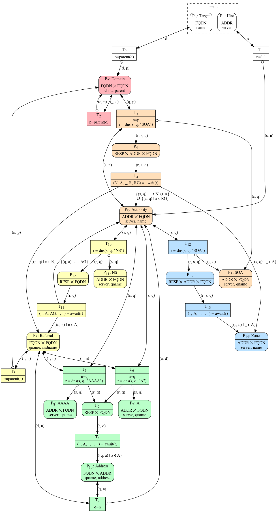

# Topo

## Scope

* Currently, transport protocols are currently not explicitly dealt with.
* Currently, dead servers are currently not explicitly dealt with.
* Currently, only data collection is dealt with. Analysis also needs to be taken
  care of, as well as the interface between collection and analysis.

## Description

This algorithm is defined in terms of a [Coloured Petri net] (CPN) with a few
tweaks to its notation and semantics.

## Notation

The background colors of the places and transitions in the diagram do not
reflect the color set of the places.
Instead they are meant to aid understanding the overall structure of the
algorithm by separating its different functional parts.

A double ended arcs is equivalent to one arc in each direction, both with the
same label.

When a variable referred to only once in a transition and its arcs, the name of
the variable may be replaced with a placeholder underscore.

## Semantics

While the places in CPNs normally contain multisets of tokens, these places
contain sets of tokens.

All transitions are atomic, except the ones using the await() function.
The await() function makes the transition wait for the given RESP to complete or
time out before producing.
Multiple tokens may be awaited simultaneously.

Execution continues until no transitions are enabled firing.
The marking at the time of termination is the output marking.

No order is imposed on the order of the firing of transitions.
The output marking is not supposed to be affected by the order of execution.
If the output marking is indeed affected by the order of the firing of
transitions, then either there is a bug in the algorithm or the server responses
are affected by the order of the queries.

The color set of a place is a tuple of elements for the following possible
types:
 * ADDR - An IPv4 or IPv6 address
 * FQDN - A fully qualified domain name
 * RESP - A handle representing an outstanding DNS request

## Functions

The guard expression of a transition may use one of the following functions.

### parent(FQDN)
Returns a copy of `domain` with its least significant label removed.
If `domain` contains no labels, an identical FQDN is returned.

### dns(ADDR, FQDN, RRTYPE)
The arguments it takes are: a server to send a DNS request to, a name and a
record type to query the server about.
It returns a RESP value.

### await(RESP)
It waits for the response to arrive or the request to time out, and then returns
a tuple of five sets.

If the request times out or if the response's RCODE is different from
NOERROR, all five sets are returned empty.

If the response's RCODE is NOERROR, the five sets are calculated in the
following way:
 1. The Nodata set.
    If the response has the NODATA pseudo RCODE, a sentinel value is put
    into this set.
    Otherwise it's empty.
 2. The Answer set.
    If the response has the AA flag set, for each record in the response's
    answer section that matches the query name and query type, the RDATA is
    added to the Answer set.
    The type of the elements depends on the query type.
 3. The Answer glue set.
    If the query type is NS, for each A and AAAA record in the additional
    response section whose owner name matches an element in the Answer set,
    the ADDRESS is added to the Answer glue set.
    If the query type is different from NS, the Answer glue set is returned
    empty.
 4. The Referral set.
    For each NS record in the response's authority section that matches the
    query name argument, the NSDNAME is added to the Referral set.
 5. The Referral glue set.
    For each A and AAAA record in the additional response section whose
    owner name matches an element in the Answer set, the ADDRESS is added to
    the Referral glue set.

The type of the elements in the Answer set depends on the query type like
so:
 * SOA: empty tuples
 * NS: FQDNs
 * A: ADDRESS
 * AAAA: ADDRESS

## Inputs
* A set of root hints.
* A domain name.

## Outputs
* A set of chains of zone authorities. The chains of zone authorities for the
  given domain and for each encountered out-of-bailiwick name server.
* A set of (domain name, IP address) pairs. The domain name and address of each
  encountered out-of-bailiwick name server.

## Procedure

The Target and Hint places are where the input objects are added before the
starting the execution.
All other places start out empty.

The t1 transition initializes the net from the inputs by putting an
object for the target domain into the Domain place and one object per root
server into the Auth place.

The Domain place tracks what domains we're interested in.
It represents all the nodes in a DNS tree where the leaves are either a target
given in the inputs or the name of an out-of-bailiwick name server.

The first thing to happen after t1 is that t2 makes sure
all ancestors of the added domain are also added.

The Auth place tracks what servers are authoritative for each domain we're
interested in.

Recall that after initialization t2 starts to populate Domain with
the ancestors of the target domain.
Once the top level domain of the target domain is added to Domain, t3
wakes up and starts adding objects to SOA/TX, one for each root server.

The t4 transition sends out each of the queries, and when each
response is received, t5 is fired.
If a response is NODATA or if it contains an authoritative SOA record for the
queried name, the queried server is added to Auth as authoritative for the
queried name.
For any referral with glue, the glue address is added to Auth as authoritative
for the queried name.
For any out-of-bailiwick referral, the NSDNAME is added to Oob together with the
name it is authoritative for.

As servers for the top level domain are added to Auth, t3 will start
waking up adding queries about the second level domain to those servers.
And so on until the servers for the target domain have all been found, and
execution terminates.

Unless, of course, out-of-bailiwick name servers were found along the way.
In that case we want to add the addresses for the name server to the Auth place.
If we can do that the machinery described above will take care of the rest on
its own.

We we need to do is to determine the authoritative servers for its domain name,
ask those servers about for addresses, and we need to connect the addresses back
to the domain name that gave us the out-of-bailiwick name server.

By adding the name server name of the out-of-bailiwick name server to Domain
using t6, we ensure that the servers that are authoritative for that
name will be found.

When servers are added to Auth that are authoritative for the a name server name
in Oob (or the other way around), t7 wakes up and starts adding
objects to A/TX and AAAA/TX.

The transitions t8, t9, t10 and t11
work together to query the servers for A nad AAAA records and those records are
added to Addr.

Once addresses start showing up in Addr, t12 will start waking up to
correlate out-of-bailiwick referrals with name server addresses and adding them
to Auth, which is all we needed to do.

## Discussion

* Auth is not "complete" when NXDOMAIN is returned for a domain in the middle of
  Domain.
* Oob is defined in relation to the apex, but this algorithm works as if the
  apex of a domain is always the domain itself.

[Coloured Petri net]: https://en.wikipedia.org/wiki/Coloured_Petri_net
