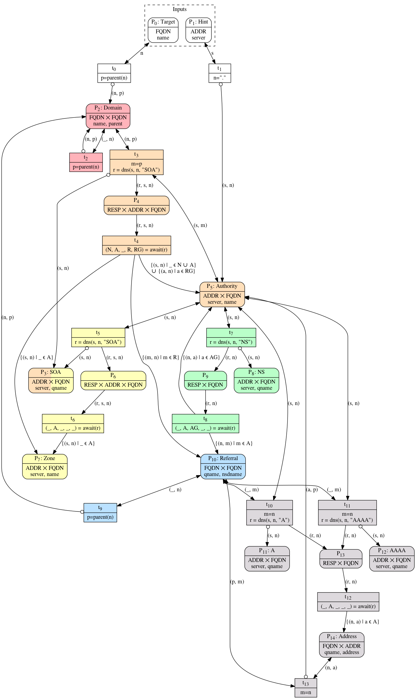

# Topo

#### Inputs
* A set of root hints.
* A domain name.

#### Outputs
* A set of chains of zone authorities. The chains of zone authorities for the
  given domain and for each encountered out-of-bailiwick name server.
* A set of (domain name, IP address) pairs. The domain name and address of each
  encountered out-of-bailiwick name server.

#### Procedure

This algorithm is defined in terms of a [Coloured Petri net] (CPN) with a few
modifications to its rules.
1. Unlike in regular CPNs where places track multisets of objects, these places
   track sets of objects.
2. A transition can only fire if it would send at least one object into a place
   where it hasn't been seen before.
3. Execution continues with live transitions firing in any order until all
   transitions are dead, causing the execution to terminate.

When a variable is used in a single place and never referred to, its name is
replaced with a placeholder underscore.

Three functions are available for use by the transitions.

1. The `parent(domain: FQDN) → FQDN` function returns a copy of `domain` with
   its least significant label removed. If `domain` contains no labels, an
   identical FQDN is returned.

2. The `send(server: ADDR, qname: FQDN, qtype: RRTYPE)` function sends a DNS
   query for `qname` and `qtype` to `server`.

3. The `receive(server: ADDR, qname: FQDN, qtype: RRTYPE) -> (bool, {RDATA},
   {(ADDR)}, {(FQDN)})` returns the interpreted response received for a DNS
   query for `qname` and `qtype` to `server`.
   The elements of the returned tuple are as follows:
   1. A boolean indicating whether response is NODATA.
   2. A set of RDATA values, with one element per record in the answer section
      that matches `qname` and `qtype`.
      However if the AA flag is unset, this set is returned empty.
      N.B. the exact type of the RDATA values depends on the value of `qtype`.
   3. A set of name server addresses, with one element for each NS record in the
      authority section that also comes with glue in the additional section.
   4. A set of name server names, with one element for each NS record in the
      authority section that is out-of-bailiwith for `qname`.

The Target and Hint places are where the input objects are added before the
starting the execution.
All other places start out empty.

The t1 transition initializes the net from the inputs by putting an
object for the target domain into the Domain place and one object per root
server into the Auth place.

The Domain place tracks what domains we're interested in.
It represents all the nodes in a DNS tree where the leaves are either a target
given in the inputs or the name of an out-of-bailiwick name server.

The first thing to happen after t1 is that t2 makes sure
all ancestors of the added domain are also added.

The Auth place tracks what servers are authoritative for each domain we're
interested in.

Recall that after initialization t2 starts to populate Domain with
the ancestors of the target domain.
Once the top level domain of the target domain is added to Domain, t3
wakes up and starts adding objects to SOA/TX, one for each root server.

The t4 transition sends out each of the queries, and when each
response is received, t5 is fired.
If a response is NODATA or if it contains an authoritative SOA record for the
queried name, the queried server is added to Auth as authoritative for the
queried name.
For any referral with glue, the glue address is added to Auth as authoritative
for the queried name.
For any out-of-bailiwick referral, the NSDNAME is added to Oob together with the
name it is authoritative for.

As servers for the top level domain are added to Auth, t3 will start
waking up adding queries about the second level domain to those servers.
And so on until the servers for the target domain have all been found, and
execution terminates.

Unless, of course, out-of-bailiwick name servers were found along the way.
In that case we want to add the addresses for the name server to the Auth place.
If we can do that the machinery described above will take care of the rest on
its own.

We we need to do is to determine the authoritative servers for its domain name,
ask those servers about for addresses, and we need to connect the addresses back
to the domain name that gave us the out-of-bailiwick name server.

By adding the name server name of the out-of-bailiwick name server to Domain
using t6, we ensure that the servers that are authoritative for that
name will be found.

When servers are added to Auth that are authoritative for the a name server name
in Oob (or the other way around), t7 wakes up and starts adding
objects to A/TX and AAAA/TX.

The transitions t8, t9, t10 and t11
work together to query the servers for A nad AAAA records and those records are
added to Addr.

Once addresses start showing up in Addr, t12 will start waking up to
correlate out-of-bailiwick referrals with name server addresses and adding them
to Auth, which is all we needed to do.

#### Discussion

* Auth is not "complete" when NXDOMAIN is returned for a domain in the middle of
  Domain.
* Oob is defined in relation to the apex, but this algorithm works as if the
  apex of a domain is always the domain itself.

[Coloured Petri net]: https://en.wikipedia.org/wiki/Coloured_Petri_net
